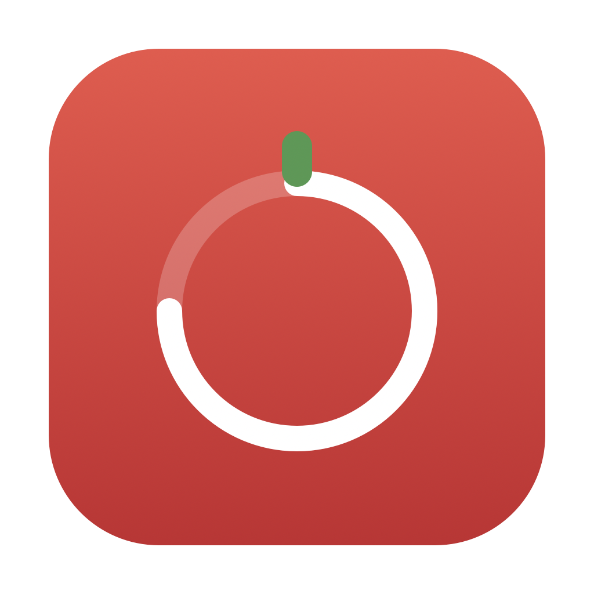
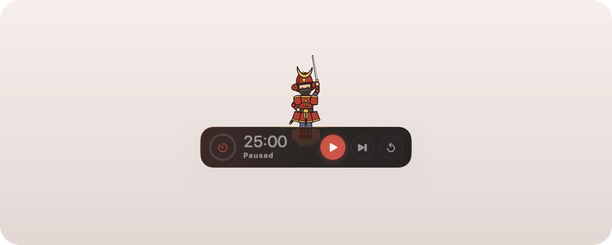
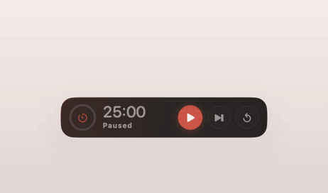
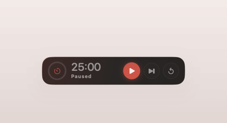
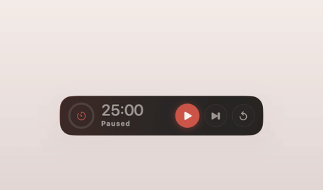
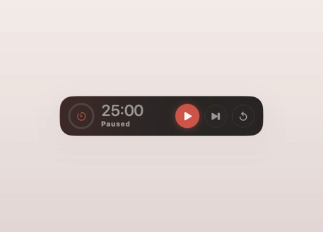
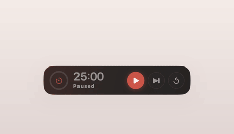
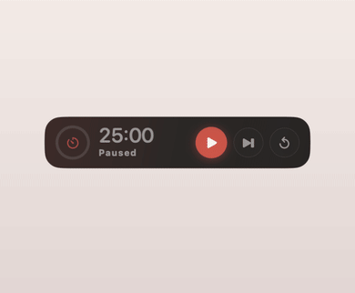

<div align="center">



# Pomodoro

**A menu bar pomodoro timer for macOS, with a floating glass bar<br>and a small cast of characters who show up when a session ends.**

[](#requirements)
[](https://www.swift.org)
[](https://developer.apple.com/xcode/swiftui/)
[](LICENSE)

[Install](#install) · [Features](#features) · [The cast](#the-cast) · [Build from source](#build-from-source) · [RigStudio](#rigstudio)

<br>



</div>

<br>

No Dock icon and no window to manage. The countdown lives in the menu bar, and a floating pill sits wherever you drop it. When a phase changes, a character pops out from behind the pill, does one short move, and goes back.

## Features

<table>
<tr>
<td width="50%" valign="top">

### ⏱&nbsp; The cycle
Focus, short break and long break, with the long break every *n* pomodoros. Every duration (1 to 240 minutes) and the cycle length can be changed. Breaks and the next focus session can each start on their own.

</td>
<td width="50%" valign="top">

### 🫧&nbsp; The floating bar
A draggable glass pill with a progress ring, the countdown and the phase. Play and pause are always there, with reset and skip on hover. It can shrink while a timer runs and opens again when you come near it.

</td>
</tr>
<tr>
<td valign="top">

### 🎭&nbsp; Six characters
A samurai, a ninja, a man in a rabbit suit, a general, Power and Boa Hancock. Each has its own move for focus start, break start and long break. They are decoration; the notification and the chime do the real work.

</td>
<td valign="top">

### 🎵&nbsp; Music that follows focus
Pauses Music or Spotify when focus ends and resumes it when focus starts again. It never guesses: it only presses play on a player it can see paused, or one it paused itself.

</td>
</tr>
<tr>
<td valign="top">

### 🔔&nbsp; Alerts
A notification banner and a system chime at each change, with separate sounds for focus and break and a volume control.

</td>
<td valign="top">

### 📊&nbsp; Widget and stats
A desktop widget in small and medium sizes, with start, pause and skip buttons through App Intents. Daily pomodoros and focus time are kept in a local JSON file. Nothing leaves your Mac.

</td>
</tr>
</table>

## The cast

Each character has three moves. Here is one move from each, recorded from the real app.

<table>
<tr>
<td align="center" width="33%"><br><b>Samurai</b><br><sub>Victory cry on a long break</sub></td>
<td align="center" width="33%"><br><b>Ninja</b><br><sub>Appears, throws, vanishes</sub></td>
<td align="center" width="33%"><br><b>Rabbit Suit Guy</b><br><sub>Mascot mode, for once</sub></td>
</tr>
<tr>
<td align="center"><br><b>The General</b><br><sub>Inspection before focus</sub></td>
<td align="center"><br><b>Power</b><br><sub>Hey hey hey!</sub></td>
<td align="center"><br><b>Boa Hancock</b><br><sub>The Empress, laughing</sub></td>
</tr>
</table>

| Character | Focus starts | Break starts | Long break |
| --- | --- | --- | --- |
| **Samurai** | One clean cut | Rests on his blade and dozes | Jumps with the blade raised |
| **Ninja** | Smoke in, shuriken, smoke out | Naps on the edge of the bar | Backflip and a bow |
| **Rabbit Suit Guy** | A very reluctant salute | One hop of mandatory fun | Commits to a spin and a ta-da |
| **The General** | Taps his stick, points, salutes | At ease, peeks over his shades | Two-step parade and a raised stick |
| **Power** | "Grovel, human!" | A huge yawn, then a nap on the bar | Her signature laughing pose |
| **Boa Hancock** | Looks down on you, points, winks | Love-struck, with a heart | Sweeps her cape and laughs "hohoho" |

Pick one, or none, in Settings.

## Install

### Requirements

- macOS 14 or later
- Xcode 16 or later (for the Swift 6 toolchain)

### Build and install

```bash
git clone https://github.com/YorgoTabet/pomodoro-timer.git
cd pomodoro-timer
./Scripts/build.sh
```

This builds the app and the widget in release mode, puts them together as `Pomodoro.app`, draws the icon, signs the bundle, and copies it to `/Applications` (or `~/Applications` if the first is not writable). Open it from Launchpad or Spotlight, and look for the timer in your menu bar.

To build the bundle without installing it:

```bash
./Scripts/build.sh --no-install
```

<details>
<summary><b>Permissions keep resetting after a rebuild?</b> Read this about signing.</summary>

<br>

The build script looks for a real code signing certificate and falls back to an ad-hoc signature if it can't find one. Ad-hoc builds run fine, but macOS ties the permissions you grant (Accessibility, Notifications, Automation) to the app's signature, and an ad-hoc signature changes on every build. So media keys, notifications and Music control quietly stop working after each rebuild until you grant them again.

If you have a certificate, point the script at it:

```bash
CODESIGN_IDENTITY="Apple Development: you@example.com (XXXXXXXXXX)" ./Scripts/build.sh
```

The app is not sandboxed on purpose. Controlling Music and Spotify over AppleScript and sending media keys are both blocked inside the sandbox.

</details>

### First run

1. Click the timer in the menu bar and press **Start**.
2. Allow notifications when macOS asks.
3. Drag the floating bar wherever you like. It remembers the spot.
4. Open **Settings** from the menu to set durations, sounds, music control and your character.

## Build from source

```bash
swift run Pomodoro    # run without installing
swift test            # run the tests
```

`swift run` is handy for working on the UI. Notification banners are off outside a real `.app` bundle (the API crashes otherwise), so you get the chime and nothing else.

## RigStudio

The characters are drawn from vector paths and moved by a small joint rig. Judging that by reading keyframes doesn't work, so the animation has its own workbench. It is a separate program and never ships inside the app.

```bash
swift run RigStudio
```

It plays every move with a scrubbable timeline, onion skin, joint pivots and live angles. It also runs without a window:

| Command | What it does |
| --- | --- |
| `swift run RigStudio --filmstrip <dir>` | Renders a contact sheet per character, so a move can be checked frame by frame |
| `swift run RigStudio --proportions <dir>` | Sweeps Power's proportion dials across their range, so a value is judged by eye |
| `swift run RigStudio --audit` | Lists joints a move never uses, and joints that freeze for over 0.9s in the middle of a move |

## Project layout

| Target | What lives there |
| --- | --- |
| `PomodoroCore` | The cycle rules, settings, stats and the shared store the widget reads. No AppKit and no timers |
| `PomodoroUI` | SwiftUI shared by the app and the widget, plus the character art, the rig and the moves |
| `Pomodoro` | The app: menu bar, floating bar, settings, notifications, music control |
| `PomodoroWidget` | The widget extension, built as a plain executable and put into the bundle by hand, since SwiftPM has no app extensions |
| `RigStudio` | The animation workbench |

Design notes and specs are in [`docs/`](docs/).

## Credits

Power is a character from *Chainsaw Man* by Tatsuki Fujimoto. Boa Hancock is a character from *One Piece* by Eiichiro Oda. Both versions here are fan art, are not affiliated with or endorsed by the rights holders, and are not covered by this project's license. The other characters are original.

## License

MIT. See [LICENSE](LICENSE).
